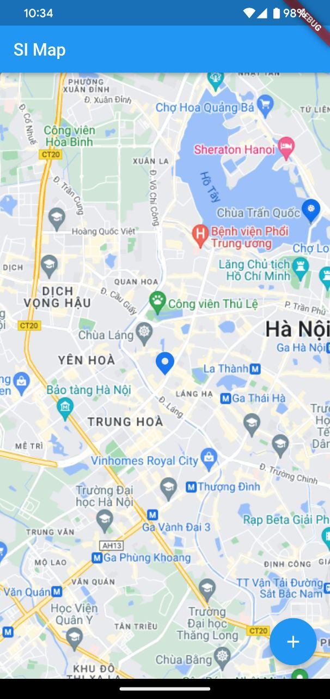
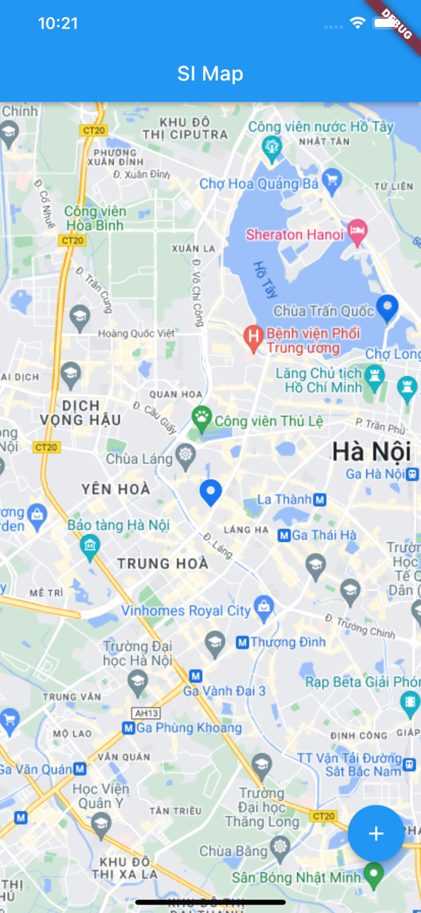

# SI Mobile Map
A versatile mapping package for Flutter, based off of 'flutter_map'.

<table width="100%" cellspacing="0" cellpadding="0" rules="none">
  <tr>
    <td align="center">Android</td>
     <td align="center">iOS</td>
  </tr>
  <tr>
    <td align="center"></td>
    <td align="center"></td>
  </tr>
 </table>

## Usage
To use this plugin, add `si_map` as a [dependency in your pubspec.yaml file](https://flutter.dev/docs/development/packages-and-plugins/using-packages).

### Step 0
Import package
```dart
import 'package:si_map/si_map.dart';
```

### Step 1
Define a controller:
```dart
late SimpleMapController simpleMapController;
```

### Step 2
Use `SimpleMap` widget
```dart
SimpleMap(
  center: MarkerData(latitude: 21.0189466, longitude: 105.806965),
  onReady: (SimpleMapController controller) {
    simpleMapController = controller;
  },
  markerData: [
    MarkerData(
      latitude: 21.0189466, longitude: 105.806965, assetName: AppImages.icMarkerStart, width: 22, height: 28),
    MarkerData(
      latitude: 21.04800248115968,
      longitude: 105.83679907011334,
      assetName: AppImages.icMarkerStart,
      width: 22,
      height: 28, onTap: (lat, lon) {
        debugPrint("hello");
    })
  ],
  useCluster: true,
  clusterSize: const Size(50, 50),
  clusterWidgetBuilder: (context, count) {
    return Container(
      decoration: const BoxDecoration(
        color: Colors.blueAccent,
        shape: BoxShape.circle
      ),
      alignment: Alignment.center,
      child: Text("$count"),
    );
  },
)
```

[comment]: <> (Android                    |  iOS)

[comment]: <> (:-------------------------:|:-------------------------:)

[comment]: <> (![]&#40;https://raw.githubusercontent.com/mobilesi/si_map/task%23update-readme/doc/screenshots/android.jpg&#41;  |  ![]&#40;https://raw.githubusercontent.com/mobilesi/si_map/task%23update-readme/doc/screenshots/ios.png&#41;)

[comment]: <> ()

[comment]: <> ()

[comment]: <> (<br>)

### Step 3
When you want to move to the position on map:
```dart
simpleMapController.moveToPosition(21.04800248115968, 105.83679907011334);
```

### Step 4
When you want to update list markers on map:
```dart
simpleMapController.updateMarkers([]);
```

### Full example
```dart
import 'package:example/res/resources.dart';
import 'package:flutter/material.dart';
import 'package:si_map/si_map.dart';

void main() {
  runApp(const MyApp());
}

class MyApp extends StatelessWidget {
  const MyApp({super.key});

  // This widget is the root of your application.
  @override
  Widget build(BuildContext context) {
    return MaterialApp(
      title: 'Flutter Demo',
      theme: ThemeData(
        // This is the theme of your application.
        //
        // Try running your application with "flutter run". You'll see the
        // application has a blue toolbar. Then, without quitting the app, try
        // changing the primarySwatch below to Colors.green and then invoke
        // "hot reload" (press "r" in the console where you ran "flutter run",
        // or simply save your changes to "hot reload" in a Flutter IDE).
        // Notice that the counter didn't reset back to zero; the application
        // is not restarted.
        primarySwatch: Colors.blue,
      ),
      home: const MyHomePage(title: 'Flutter Demo Home Page'),
    );
  }
}

class MyHomePage extends StatefulWidget {
  const MyHomePage({super.key, required this.title});

  // This widget is the home page of your application. It is stateful, meaning
  // that it has a State object (defined below) that contains fields that affect
  // how it looks.

  // This class is the configuration for the state. It holds the values (in this
  // case the title) provided by the parent (in this case the App widget) and
  // used by the build method of the State. Fields in a Widget subclass are
  // always marked "final".

  final String title;

  @override
  State<MyHomePage> createState() => _MyHomePageState();
}

class _MyHomePageState extends State<MyHomePage> {
  int _counter = 0;

  void _incrementCounter() {
    setState(() {
      // This call to setState tells the Flutter framework that something has
      // changed in this State, which causes it to rerun the build method below
      // so that the display can reflect the updated values. If we changed
      // _counter without calling setState(), then the build method would not be
      // called again, and so nothing would appear to happen.
      _counter++;
    });
  }

  late SimpleMapController simpleMapController;

  @override
  Widget build(BuildContext context) {
    // This method is rerun every time setState is called, for instance as done
    // by the _incrementCounter method above.
    //
    // The Flutter framework has been optimized to make rerunning build methods
    // fast, so that you can just rebuild anything that needs updating rather
    // than having to individually change instances of widgets.
    return Scaffold(
      appBar: AppBar(
        // Here we take the value from the MyHomePage object that was created by
        // the App.build method, and use it to set our appbar title.
        title: Text(widget.title),
      ),
      body: SimpleMap(
        center: MarkerData(latitude: 21.0189466, longitude: 105.806965),
        onReady: (SimpleMapController controller) {
          simpleMapController = controller;
        },
        markerData: [
          MarkerData(
              latitude: 21.0189466, longitude: 105.806965, assetName: AppImages.icMarkerStart, width: 22, height: 28),
          MarkerData(
              latitude: 21.04800248115968,
              longitude: 105.83679907011334,
              assetName: AppImages.icMarkerStart,
              width: 22,
              height: 28, onTap: (lat, lon) {
            debugPrint("hello");
          })
        ],
        useCluster: true,
        clusterSize: const Size(50, 50),
        clusterWidgetBuilder: (context, count) {
          return Container(
            decoration: const BoxDecoration(
                color: Colors.blueAccent,
                shape: BoxShape.circle
            ),
            alignment: Alignment.center,
            child: Text("$count"),
          );
        },
      ),
      floatingActionButton: FloatingActionButton(
        onPressed: () {
          simpleMapController.moveToPosition(21.04800248115968, 105.83679907011334);
          simpleMapController.updateMarkers([
            MarkerData(
                latitude: 21.04800248115968,
                longitude: 105.83679907011334,
                assetName: AppImages.icMarkerStart,
                width: 22,
                height: 28, onTap: (lat, lon) {
              debugPrint("hello");
            })
          ]);
        },
        tooltip: 'Increment',
        child: const Icon(Icons.add),
      ), // This trailing comma makes auto-formatting nicer for build methods.
    );
  }
}

```
